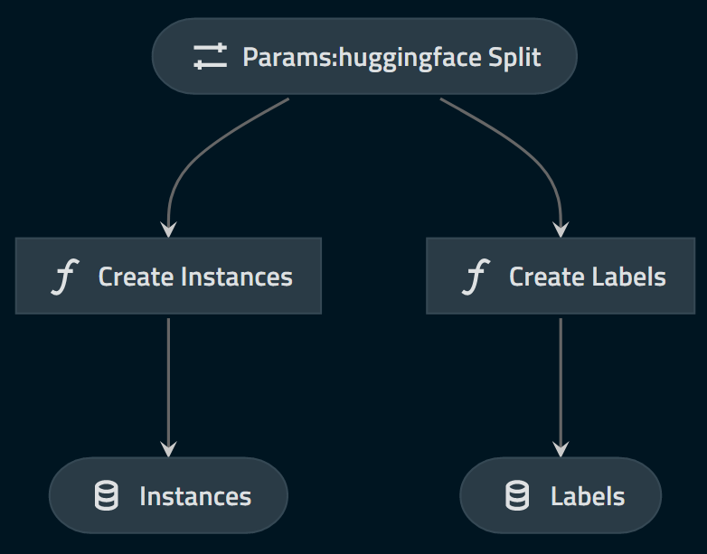

# Framework example

## Introduction

### Pre-requisite

This assumes the user is familiar with Kedro. We will refer to a `kedro>=0.16.5, <0.17.0` project template files (e.g. `catalog.yml`, `pipeline.py` and `hooks.py`).

### Disclaimer

**This is NOT a Kaggle competition. I will not try to create the best model (nor even a _good_ model)** to solve this problem. The goal of this tutorial is to demonstrate how the `pipeline_ml_factory` can help to maintain consistency between training and inference and prepare deployment.

The associated code can be found on github, under [kedro-mlflow-imdb](https://github.com/Galileo-Galilei/kedro-mlflow-imdb) repo.

### Introducing the task and dataset

We will use the [IMDB movie review](https://www.kaggle.com/lakshmi25npathi/imdb-dataset-of-50k-movie-reviews) dataset as an example. This dataset contains 50k movie reviews with associated "positive" or "negative" value manually labelled by a human.

We will train a classifier for binary classification to predict the sentiment associated to a movie review.

You can find [many notebooks on Kaggle](https://www.kaggle.com/lakshmi25npathi/imdb-dataset-of-50k-movie-reviews/notebooks) to learn more about this dataset.

## Building the project

To understand the division in *etl_app*, *ml_app* and *user_app*, you can refer to ["The components of a machine learning application"](./02_ml_project_components.md).

### The etl_app

We create a very basic `etl_app` for this example. It can be really complex in real life. What matters is that it is composed of two pipelines which produce `instances` and `labels` datasets.

The DAG looks like this:



Where the "huggingface_split" parameter is just here to define if we should produce "training" or " data. We persist the `instances` and `labels` in the DataCatalog for further reuse:

```yaml
# catalog.yml
#### ETL
instances:
  type: pickle.PickleDataSet
  filepath: data/01_raw/instances_${huggingface_split}.pkl

labels:
  type: pickle.PickleDataSet
  filepath: data/01_raw/labels_${huggingface_split}.pkl
```


### The ml_app

Once the instances and labels have been created with the *etl_app*, we can launch the ml pipelines.

#### A vanilla example: training a machine learning model

The most basic project we can imagine is the following: the business object is a numeric matrix, and we want to train our model on it.

#### Sharing preprocessing: text cleaning example

#### Reusing data objects: the example of OneHotEncoder

#### Reusing shared inputs: the example of stopwords

#### Adding some metrics and monitoring

### The user_app

Use `MlflowModelLoggerDataset` to force reading from a given run_id.
